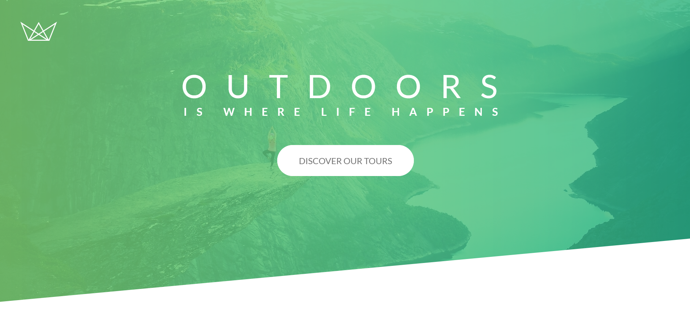

<h1 align="center">
     NATOURS
</h1>

##  🕵About

In this repository you find the code for the Natours' LandingPage, a fictional company that sells tours through natural places. 
##  👩🏾Who does

- Eduardo Rottschaefer Oliveira

Conect with me on LinkedIn! - https://www.linkedin.com/in/eduardo-rottschaefer

---
##  🧭Status do Projeto

 - ⌛ In production

---

##  🎯Project's Purpose

The main goal is to enhance my skills CSS skills, implementing a modern clean code while diving in the CSS and Sass structure to enhance the app performance. 

This project is part of the [Advanced CSS and Sass](https://www.udemy.com/course/advanced-css-and-sass/) from Jonas Schmedtmann.
Differently from the course, I'm using React with Styled-Components to achieve the same result. 

## ☑️Features

- [x] Clean Code
- [x] Modern CSS techniques
- [x] CSS animations
- [x] Add products to cart

## 👨‍💻Technologies and Structures

- [x] ReactJS
- [x] JavaScript
- [x] HTML/CSS
- [x] Styled-Components
- [x] Component Structure

## 🔗Deploy Link

- **Deploy Link**: https://natours-eight-plum.vercel.app/#

---

## 🛰Running the Project

- Clone this repository on your machine with the command git clone https://github.com/Rottschaefer/vivra-ecommerce.git
- Open the project file through the terminal
- Run npm install command
- Run npm start command
- Ready! Now the application is already running on your machine :)
- Enjoy :)

---

## 📝License

This project is under the MIT license [MIT](./LICENSE).
